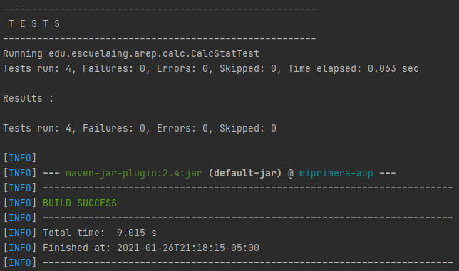
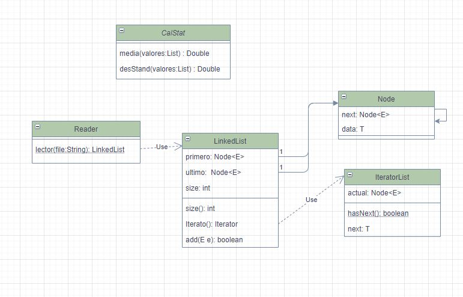

# Introduction to complex systems, java, mvn, and git

En este proyecto se creó una API de una calculadora de media y desviación estándar, Adicionalmente se generó una LinkedList y un lector de archivos.

## Empezando

Las instrucciones que encontrara a continuación le proporcionaran una copia del proyecto en funcionamiento en su máquina local para fines de desarrollo y prueba.
### Prerrequisitos

Para poder utilizar esta aplicación se deben tener instalados los siguientes software:

```
Maven
```
```
Git
```
```
Java
```

## Ejecutando las pruebas



### Desglose en pruebas

Las pruebas que se realizaron en este proyecto evalúan el funcionamiento de
la calculadora y hacen uso de un lector de archivos para acceder a los datos.

```
Funcionamiento de la calculadora con los datos 1
```
- 160.0
- 591.0
- 114.0
- 229.0
- 230.0
- 270.0
- 128.0
- 1657.0
- 624.0
- 1503.0
```
Funcionamiento de la calculadora con los datos 2
```
- 15.0
- 69.9
- 6.5
- 22.4
- 28.4
- 65.9
- 19.4
- 198.7
- 38.8
- 138.2

##Arquitetura General



Como podemos notar en diagrama se generaron cinco clases fundamentales, la principal es la nombrada
CalStat la cual es la encargada de realizar las funciones de la API creada, por otro lado también se puede
ver LinkedList que es la implementación realizada a una lista en java, para el correcto funcionamiento básico
de este objeto se crearon dos clases adicionales una es Node que se refiere a la abstracción del nodo de la
lista que se desea implementar, también se generó la clase IteratorList que es la encargada de recorrer los
elementos que se almacenen en la lista.

## Construcción 
* [Maven](https://maven.apache.org/) - Dependencias de maven


## Autores

* **Juan Sebastian Ramos Isaza** 

## Licencia

En este proyecto se usó la licencia GNU - se puede ver [LICENSE.txt](LICENSE.txt) para más detalles.


 